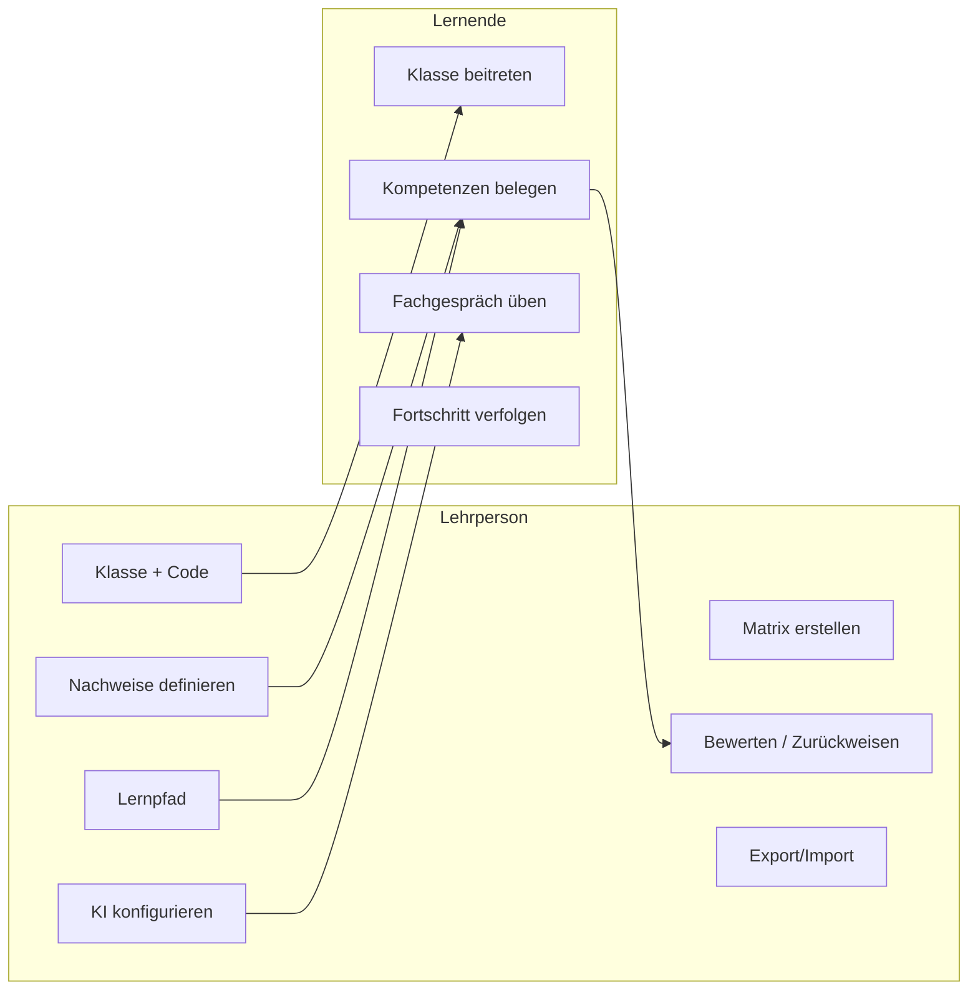

# 02 – Rollen & Use Cases

## 1. Rollen

| Rolle                      | Beschreibung                                                                                                      |
| -------------------------- | ----------------------------------------------------------------------------------------------------------------- |
| **Administrator**          | Verwaltet Mandant/Schule, globale Einstellungen, Auth-Provider, Benutzerrollen. (Optional je nach Betriebsmodell) |
| **Lehrperson** (Teacher)   | Erstellt/verwaltet Module, Kompetenzmatrizen, Klassen, Aufgaben, Lernpfade, KI-Konfiguration; bewertet Nachweise. |
| **Lernende:r** (Student)   | Tritt Klassen bei, bearbeitet Kompetenznachweise, lädt Dokumente hoch, übt Fachgespräche, sieht Fortschritt.      |
| **Gast/Unauthentifiziert** | Kann sich nur einloggen/registrieren (über OIDC).                                                                 |

> Eine Person kann mehrere Rollen besitzen (z.B. Lehrperson, die auch Admin ist). Rollen werden
> pro **Mandant** (Schule) zugewiesen → siehe [08-Authentifizierung](./08-authentifizierung.md).

## 2. Berechtigungsmatrix (RBAC)

| Aktion                                        |    Admin     |     Lehrperson      |      Lernende:r       |
| --------------------------------------------- | :----------: | :-----------------: | :-------------------: |
| Mandant/Schule konfigurieren                  |      ✅      |          –          |           –           |
| Auth-Provider verwalten                       |      ✅      |          –          |           –           |
| Modul + Kompetenzmatrix erstellen/bearbeiten  |      ✅      |     ✅ (eigene)     |           –           |
| Kompetenzmatrix einer Klasse zuordnen         |      –       |         ✅          |           –           |
| Klasse erstellen/bearbeiten/löschen           |      –       |     ✅ (eigene)     |           –           |
| Beitrittscode generieren                      |      –       |         ✅          |           –           |
| Klasse beitreten (per Code)                   |      –       |          –          |          ✅           |
| Lernende editieren/löschen/manuell hinzufügen |      –       | ✅ (eigene Klassen) |           –           |
| Kompetenznachweise definieren                 |      –       |         ✅          |           –           |
| Sichtbarkeit/Ablaufdatum setzen               |      –       |         ✅          |           –           |
| Lernpfad definieren                           |      –       |         ✅          |           –           |
| Nachweis bearbeiten/einreichen                |      –       |          –          |      ✅ (eigene)      |
| Nachweis bewerten / zurückweisen              |      –       |         ✅          |           –           |
| KI konfigurieren                              |      –       |     ✅ (eigene)     |           –           |
| KI-Feedback nutzen                            |      –       |         ✅          | ✅ (wenn freigegeben) |
| Fachgespräch (KI) führen/üben                 |      –       |     (Einsicht)      |          ✅           |
| Dashboard / Fortschritt einsehen              | ✅ (Mandant) | ✅ (eigene Klassen) |     ✅ (eigener)      |
| Export Matrix / Klasse                        |      –       |         ✅          |           –           |
| Import Matrix / Klasse                        |      –       |         ✅          |           –           |

## 3. Use Cases – Lehrperson

### UC-T01: Kompetenzmatrix erstellen

**Akteur:** Lehrperson
**Ablauf:**

1. Lehrperson legt ein neues **Modul** an (Nr., Titel, Beschreibung, Sprache).
2. Erfasst **Handlungsziele** (aus Modulidentifikation).
3. Erfasst **Kompetenzbänder** (z.B. A1, B1 …) mit Beschreibung und HZ-Referenz.
4. Erfasst pro Band die **Deskriptoren** je Gütestufe (Beginner/Intermediate/Advanced, „Ich kann …").
5. Optional: Import aus Excel-Template oder bestehender Matrix.
6. Speichert die Matrix (Status: Entwurf → veröffentlicht).

### UC-T02: Klasse erstellen und Matrix zuordnen

1. Lehrperson erstellt eine **Klasse** (Name, Lehrjahr, Schuljahr).
2. Ordnet eine oder mehrere **Kompetenzmatrizen** zu.
3. System generiert **Beitrittscode** (zeitlich begrenzt, regenerierbar).
4. Teilt Code mit den Lernenden.

### UC-T03: Kompetenznachweis definieren

1. Lehrperson wählt eine **Kompetenz** (Kompetenzfeld).
2. Legt einen oder mehrere **Kompetenznachweise** an.
3. Wählt **Typ**: Quiz / Upload / Upload+KI / Fachgespräch.
4. Setzt **Sichtbarkeit** (sichtbar/verborgen) und optional **Ablaufdatum**.
5. Definiert **Bewertungsraster** (Kriterien + Indikatoren je Gütestufe) und/oder Punkte.

### UC-T04: Nachweise bewerten

1. Lehrperson sieht im Dashboard eingereichte Nachweise pro Lernende:r.
2. Öffnet einen Nachweis (Dokument, Quiz-Resultat, Fachgespräch-Verlauf).
3. Optional: ruft **KI-Bewertungsvorschlag** ab.
4. Vergibt **Punkte** / Gütestufe, schreibt Feedback.
5. Aktionen: **Bewerten** (abschliessen) oder **Zurückweisen** (zur Überarbeitung).

### UC-T05: Lernpfad definieren

1. Lehrperson erstellt einen **Lernpfad** für eine Matrix.
2. Ordnet vorhandene Kompetenzen in didaktisch sinnvolle Reihenfolge (Schritte/Etappen).
3. Veröffentlicht den Lernpfad für die Klasse.

### UC-T06: KI konfigurieren

1. Lehrperson hinterlegt **OpenAI-kompatible KI** (Basis-URL, Token, Modell, Temperatur, weitere Parameter).
2. Testet die Verbindung.
3. Legt fest, wofür die KI genutzt wird (Nachweis-Bewertung, Fachgespräch).

### UC-T07: Export / Import

1. Lehrperson exportiert eine **Matrix** (inkl. Nachweise) als Paket.
2. Importiert ein Paket in einer anderen Instanz.
3. Exportiert eine ganze **Klasse** inkl. aller Lernenden-Dokumente (Archiv) → kann Klasse danach löschen.
4. Reimportiert Archiv im Streitfall, um auf Dokumente zuzugreifen.

## 4. Use Cases – Lernende:r

### UC-S01: Klasse beitreten

1. Lernende:r loggt sich via Microsoft/Google ein.
2. Gibt **Beitrittscode** ein → wird der Klasse zugeordnet.

### UC-S02: Kompetenzen belegen

1. Lernende:r sieht die **Kompetenzmatrix** (oder **Lernpfad**, wählbar).
2. Öffnet eine sichtbare, nicht abgelaufene Kompetenz.
3. Bearbeitet den Nachweis: Quiz lösen / Dokument hochladen / Aufgabe lösen / Fachgespräch führen.
4. Reicht den Nachweis ein.
5. Erhält ggf. **KI-Feedback** (ob aus Sicht der KI korrekt).

### UC-S03: Fachgespräch üben (KI)

1. Lernende:r wählt ein Thema (von Lehrperson vorgegeben).
2. KI stellt Fragen; Lernende:r antwortet.
3. Gesprächsverlauf wird aufgezeichnet (für Lehrperson einsehbar).

### UC-S04: Fortschritt verfolgen

1. Lernende:r sieht pro Kompetenz Status (offen, eingereicht, bewertet, zurückgewiesen).
2. Sieht erreichte Gütestufen/Punkte und Gesamtfortschritt.

## 5. Use-Case-Übersicht (Diagramm)

