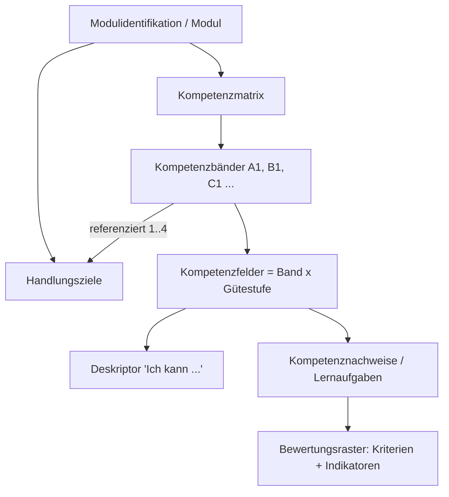
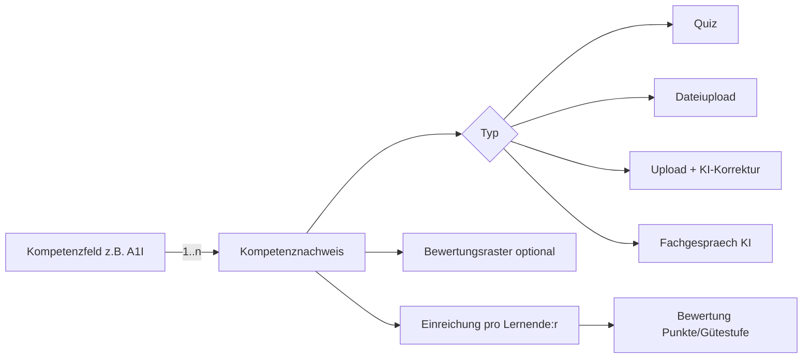
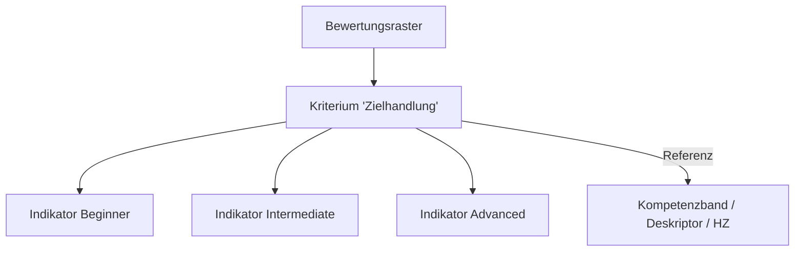
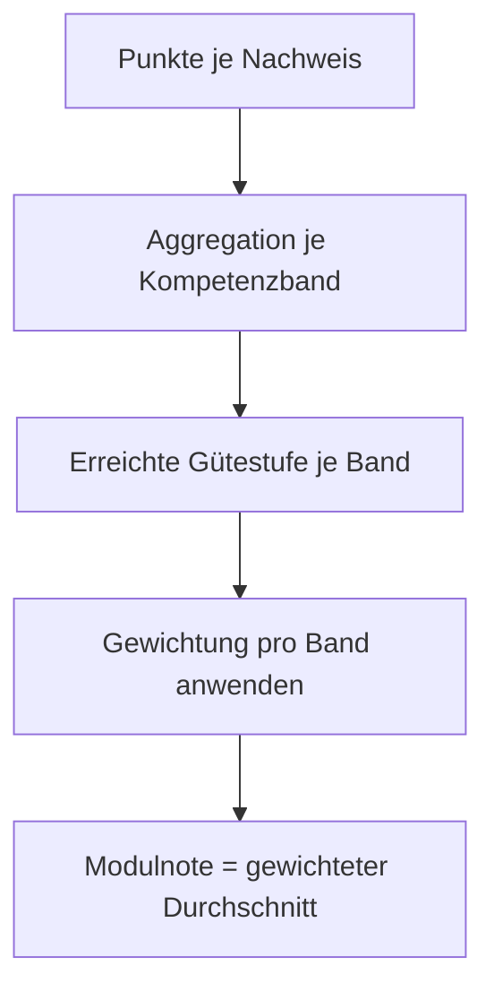

# 03 – Fachkonzept Kompetenzmatrix (Übersetzung ICT-BBCH → App)

Dieses Dokument übersetzt das offizielle Konzept *„Kompetenzmatrix für die berufliche
Grundbildung in der ICT"* (ICT-BBCH, in Kraft seit 01.06.2025) in die fachliche Logik der
Software. Es ist die **fachliche Referenz** für das [Datenmodell](./05-datenmodell.md).

---

## 1. Strukturhierarchie

### Regeln aus dem Konzept (Eckwerte)

| Element | Regel |
|---------|-------|
| Kompetenzmatrix | National i.d.R. **eine pro Modulidentifikation** (Ausnahme: eine pro Modulidentifikation + Abschluss). |
| Kompetenzband | Jedes Handlungsziel muss in **mindestens einem** Band aufgeführt sein. Ein HZ in **maximal vier** Bändern. |
| Kompetenzband ↔ HZ | Pro Band Referenz auf **1..n** Handlungsziele. Bänder können handlungszielübergreifend formuliert sein. |
| Gütestufen | **Vier** Stufen: Beginner, Intermediate, Advanced, *nicht erfüllt* (0). |
| Kompetenzfeld | Schnittpunkt Band × Gütestufe. Enthält Deskriptor. |
| Beurteilung | In der Umsetzung sind **80 %** aller Kompetenzbänder mit ≥ 1 Leistungsbeurteilung zu überprüfen. |

> **App-Konsequenz:** Das Datenmodell muss flexible n:m-Beziehungen zwischen *Kompetenzband*
> und *Handlungsziel* abbilden und die 80%-Regel als (optionale) Validierungs-/Hinweisfunktion
> unterstützen.

---

## 2. Gütestufen & Deskriptoren

Die Gütestufen sind laut Konzept:
- **in sich geschlossen** erklärt (nicht aufbauend auf vorheriger Stufe),
- **neutral** (ohne Produkt-/Methoden-Definition),
- beginnen mit **„Ich kann …"**.

| Stufe | Kürzel | Wert | Definition (Konzept) |
|-------|--------|------|----------------------|
| Beginner | B | 1 | Kenntnisse/Fertigkeiten zur Anwendung von **Teilen** der Kompetenzen. |
| Intermediate | I | 2 | **Selbständige** Anwendung und Umsetzung. |
| Advanced | A | 3 | **Fachgerechte** Anwendung und Umsetzung. |
| Nicht erfüllt | 0 | 0 | Band nicht bearbeitet (nur im Bewertungsraster vermerkt, nicht in der Matrix). |

> **App-Konsequenz:** Gütestufen sind ein **fixes Enum** (B/I/A/0). Pro Kompetenzfeld (Band ×
> Stufe B/I/A) existiert genau **ein Deskriptor**. Die Stufe „0" existiert nur als
> Bewertungsergebnis, nicht als eigenes Feld in der Matrix.

---

## 3. Darstellung der Matrix (Beispiel laut Konzept)

| Kompetenzband | HZ | Beginner | Intermediate | Advanced |
|---------------|----|----------|--------------|----------|
| A1 – Beschreibung | 1, 2 | A1B: Ich kann… | A1I: Ich kann… | A1A: Ich kann… |
| B1 – Beschreibung | 3 | B1B: Ich kann… | B1I: Ich kann… | B1A: Ich kann… |
| B2 – Beschreibung | 3 | B2B: Ich kann… | B2I: Ich kann… | B2A: Ich kann… |
| C1 – Beschreibung | 4 | C1B: Ich kann… | C1I: Ich kann… | C1A: Ich kann… |

**Kürzel-Logik:** `{Band}{Stufe}` → z.B. `A1B` = Band A1, Stufe Beginner. Dies kann die App
automatisch generieren und als stabile, sprechende Referenz (z.B. für Export) nutzen.

---

## 4. Vom Kompetenzfeld zum Kompetenznachweis (App-Kern)

Im Konzept ist die Matrix die **Beurteilungsreferenz**. Die App ergänzt darum die operative
Ebene: **Kompetenznachweise** (Lernaufgaben), mit denen Lernende eine Kompetenz belegen.

- Ein Kompetenznachweis kann sich auf **ein Kompetenzfeld** beziehen (Standard) oder – gemäss
  Bewertungs-Doku – flexibler auf **einen Deskriptor**, ein **Kompetenzband** oder **mehrere
  Bänder**. Die App erlaubt primär die Zuordnung zu Kompetenzfeld(ern); ein Nachweis kann
  mehrere Kompetenzfelder abdecken (n:m).
- Pro Nachweis ist **Sichtbarkeit** und **Ablaufdatum** steuerbar (siehe
  [04-Funktionale Anforderungen](./04-funktionale-anforderungen.md)).

---

## 5. Bewertungsraster

Aus `Bewertung.md`: Das Bewertungsraster wird pro konkreter Lernsituation/Leistungsnachweis
erstellt und bezieht sich auf die Matrix. Aufbau:

- **Kriterium**: Kurzbeschreibung der Zielhandlung (z.B. „Container-Umgebung definieren").
- **Indikator**: pro Gütestufe eine konkrete, **beobachtbare** Beschreibung der erwarteten Leistung.
- **Referenz**: auf das/die Kompetenzband/-bänder bzw. Handlungsziel(e).

Granularität (alle Varianten erlaubt, App soll flexibel sein):
1. Indikator **pro Deskriptor**,
2. Kriterium (mehrere Indikatoren) **pro Deskriptor**,
3. Kriterium **pro Kompetenzband** (weniger präzise).

**Formulierungsprinzipien (in App als Hilfetexte/Validierung):**
aktiv & beobachtbar, kontextbezogen, ohne vage Begriffe/subjektive Wertungen, Lösungsweg nicht
vorgeben.

### Alternative: Bewertung mit Leistungszielen
Statt Bewertungsraster kann auch mit **Leistungszielen** je Niveaustufe bewertet werden
(konkrete, beobachtbare Ziele je Stufe, Zuordnung zu HZ). → Die App unterstützt **beide
Modi** (Bewertungsraster ODER Leistungsziele) pro Nachweis.

---

## 6. Noten- und Punktelogik

Richtwerte (Konzept Kap. 2.7):

| Gütestufe | Note (Richtwert) |
|-----------|------------------|
| Beginner | 3.0 |
| Intermediate | 4.5 |
| Advanced | 6.0 |

> ⚠️ **Gewichtung der Kompetenzbänder** und **Notenvergabe je Gütestufe** legt der **Lernort**
> fest. Die App liefert Defaults, erlaubt aber:
> - **Gewichtung pro Kompetenzband** (z.B. Band A1 zählt doppelt),
> - **lernortspezifische Notenskala** je Gütestufe,
> - **Punktebasierte Bewertung** mit Mapping Punkte → Note.

### Notenberechnungs-Modell (konfigurierbar)

**App-Konsequenz:** Notenberechnung ist eine **konfigurierbare Strategie** (Default:
ICT-BBCH-Richtwerte). Mögliche Strategien:
1. **Gütestufen-Mapping** (B=3.0, I=4.5, A=6.0), gewichtet je Band.
2. **Punktebasiert** (Summe Punkte → Notenskala der Lehrperson).
3. **Mischform**.

Details und Formeln → [05-Datenmodell](./05-datenmodell.md), Abschnitt „Bewertung & Noten".

---

## 7. Mehrsprachigkeit

Offizielle Matrizen sind viersprachig (DE/FR/IT/EN). Konsequenz:
- Übersetzbare Felder: Modultitel, Bandbeschreibung, Deskriptoren, Handlungsziele,
  Kriterien/Indikatoren.
- Datenmodell: pro übersetzbarem Text ein **Übersetzungs-Set** (locale → text). Siehe
  [05-Datenmodell](./05-datenmodell.md) und [12-NFR](./12-nicht-funktionale-anforderungen.md).

---

## 8. Zusammenfassung der App-relevanten Designentscheide

| ID | Entscheid |
|----|-----------|
| F1 | Gütestufen als fixes Enum (B/I/A/0); 0 nur als Bewertungsergebnis. |
| F2 | Kompetenzband ↔ Handlungsziel als n:m (1..4 HZ pro Band gemäss Regel, validierbar). |
| F3 | Pro Kompetenzfeld genau ein Deskriptor („Ich kann …"). |
| F4 | Kompetenznachweis kann 1..n Kompetenzfelder abdecken (n:m). |
| F5 | Bewertung wahlweise via Bewertungsraster oder Leistungsziele. |
| F6 | Notenberechnung als konfigurierbare Strategie, Default = ICT-BBCH-Richtwerte. |
| F7 | Gewichtung pro Kompetenzband konfigurierbar (lernortspezifisch). |
| F8 | Alle fachlichen Texte mehrsprachig (DE/FR/IT/EN). |
| F9 | 80%-Abdeckungsregel als optionale Validierung/Hinweis. |
