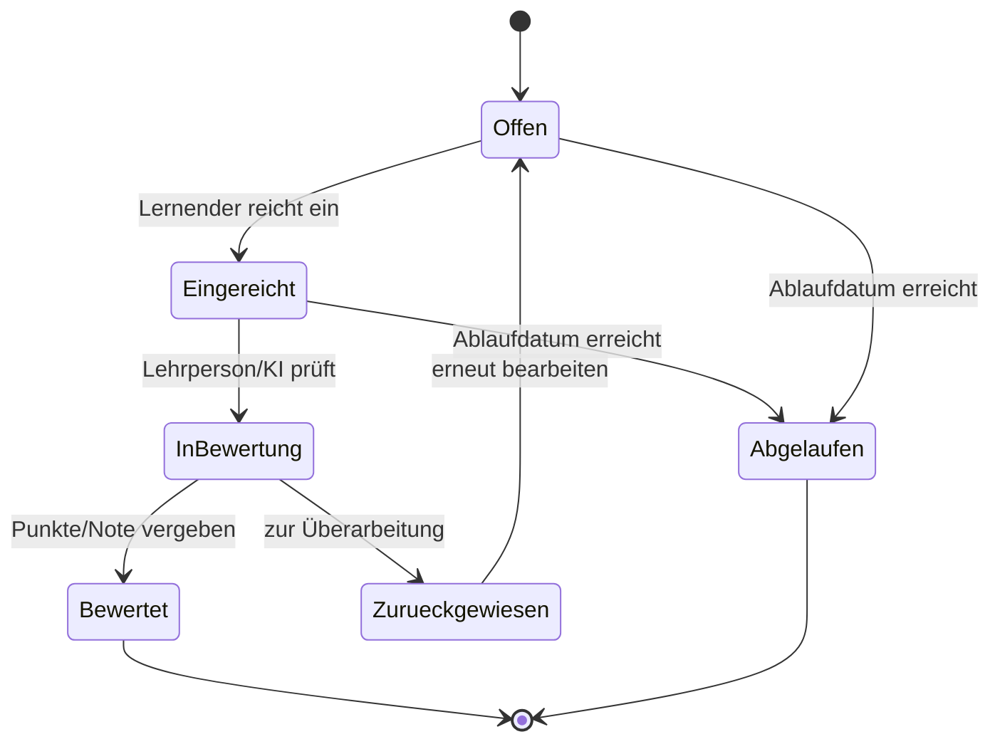

# 04 – Funktionale Anforderungen

Notation der Priorität: `MUSS` (MVP-kritisch), `SOLL` (wichtig), `KANN` (Ausbau).
Jede Anforderung hat eine ID `FA-xx`.

---

## 1. Modul- & Kompetenzmatrix-Verwaltung

| ID | Anforderung | Prio |
|----|-------------|------|
| FA-01 | Lehrperson kann ein Modul anlegen (Nr., Titel, Beschreibung, Berufsbild, Sprache). | MUSS |
| FA-02 | Lehrperson kann Handlungsziele erfassen (Nummer, Text, HZ-Referenz). | MUSS |
| FA-03 | Lehrperson kann Kompetenzbänder anlegen (Code z.B. A1, Beschreibung, HZ-Zuordnung n:m). | MUSS |
| FA-04 | Lehrperson kann pro Band Deskriptoren je Gütestufe (B/I/A) erfassen („Ich kann …"). | MUSS |
| FA-05 | System generiert Kompetenzfeld-Kürzel automatisch ({Band}{Stufe}). | SOLL |
| FA-06 | Matrix hat Status (Entwurf, veröffentlicht, archiviert). | SOLL |
| FA-07 | Validierung: jedes HZ in ≥ 1 Band, ein HZ in ≤ 4 Bändern (Warnung). | SOLL |
| FA-08 | Hinweis bei < 80% bewerteter Kompetenzbänder. | KANN |
| FA-09 | Matrix als Kopie/Vorlage duplizierbar. | SOLL |
| FA-10 | Mehrsprachige Felder (DE/FR/IT/EN) für alle fachlichen Texte. | SOLL |
| FA-11 | Import aus ICT-BBCH Excel-Template (.xltx/.xlsx). | KANN |

## 2. Klassenverwaltung

| ID | Anforderung | Prio |
|----|-------------|------|
| FA-20 | Lehrperson kann Klassen anlegen (Name, Lehrjahr, Schuljahr). | MUSS |
| FA-21 | Lehrperson kann einer Klasse 1..n Matrizen zuordnen. | MUSS |
| FA-22 | System generiert Beitrittscode (kurz, eindeutig, regenerierbar, optional ablaufend). | MUSS |
| FA-23 | Lernende treten per Code bei. | MUSS |
| FA-24 | Lehrperson kann Lernende editieren, löschen, manuell hinzufügen. | MUSS |
| FA-25 | Lehrperson sieht Mitgliederliste mit Status. | MUSS |
| FA-26 | Beitritts-Genehmigung optional (auto/manuell). | KANN |

## 3. Kompetenznachweise / Lernaufgaben

| ID | Anforderung | Prio |
|----|-------------|------|
| FA-30 | Lehrperson kann pro Kompetenz(-feld) 1..n Nachweise anlegen. | MUSS |
| FA-31 | Nachweis kann mehrere Kompetenzfelder abdecken (n:m). | SOLL |
| FA-32 | Nachweistyp: **Quiz**. | MUSS |
| FA-33 | Nachweistyp: **Dateiupload**. | MUSS |
| FA-34 | Nachweistyp: **Upload + KI-Korrektur**. | SOLL |
| FA-35 | Nachweistyp: **Fachgespräch (KI)**. | SOLL |
| FA-36 | Pro Nachweis: Sichtbarkeit (sichtbar/verborgen). | MUSS |
| FA-37 | Pro Nachweis: Ablaufdatum (nach Ablauf kein Upload/Bearbeiten mehr). | MUSS |
| FA-38 | Pro Nachweis: zeitgesteuerte Freischaltung (Start-/Endzeit, z.B. für Test). | SOLL |
| FA-39 | Pro Nachweis: Bewertungsraster ODER Leistungsziele definierbar. | SOLL |
| FA-40 | Pro Nachweis: max. Punkte / Ziel-Gütestufe. | MUSS |
| FA-41 | Mehrere Abgaben/Versuche konfigurierbar. | KANN |

### Quiz-Spezifika
| ID | Anforderung | Prio |
|----|-------------|------|
| FA-42 | Fragetypen: Single/Multiple Choice, Wahr/Falsch, Lückentext, Freitext. | SOLL |
| FA-43 | Automatische Auswertung für geschlossene Fragetypen. | SOLL |
| FA-44 | Freitextfragen optional via KI vorbewertet. | KANN |

## 4. Bearbeitung durch Lernende

| ID | Anforderung | Prio |
|----|-------------|------|
| FA-50 | Lernende sehen ihre zugeordnete Matrix (nur sichtbare, gültige Nachweise). | MUSS |
| FA-51 | Lernende können Nachweise bearbeiten und einreichen. | MUSS |
| FA-52 | Lernende erhalten optional KI-Feedback nach Einreichung. | SOLL |
| FA-53 | Lernende sehen Status pro Nachweis (offen, eingereicht, in Bewertung, bewertet, zurückgewiesen). | MUSS |
| FA-54 | Bei Rückweisung: Lernende können überarbeiten und erneut einreichen. | MUSS |
| FA-55 | Nach Ablaufdatum ist Einreichen gesperrt. | MUSS |

## 5. Bewertung durch Lehrperson

| ID    | Anforderung                                                                     | Prio |
| ----- | ------------------------------------------------------------------------------- | ---- |
| FA-60 | Lehrperson sieht pro Lernende:r Anzahl eingereichter/erledigter Nachweise.      | MUSS |
| FA-61 | Lehrperson kann einzelne Nachweise einsehen (Dokument, Quiz, Gesprächsverlauf). | MUSS |
| FA-62 | Lehrperson kann Punkte/Gütestufe vergeben + Feedback schreiben.                 | MUSS |
| FA-63 | Lehrperson kann Nachweis zur Überarbeitung zurückweisen (mit Begründung).       | MUSS |
| FA-64 | Lehrperson kann KI-Bewertungsvorschlag abrufen und übernehmen/überschreiben.    | SOLL |
| FA-65 | Bewertungshistorie/Audit (wer, wann, was) – nachvollziehbar & revisionssicher.  | MUSS |
| FA-66 | Sammelaktionen (mehrere Nachweise gleichzeitig bewerten).                       | KANN |

## 6. Lernpfad

| ID | Anforderung | Prio |
|----|-------------|------|
| FA-70 | Lehrperson kann pro Matrix einen Lernpfad definieren (geordnete Schritte). | SOLL |
| FA-71 | Lernpfad referenziert bestehende Kompetenzen (keine Duplikation). | SOLL |
| FA-72 | Lernende können zwischen Matrix- und Lernpfad-Ansicht wechseln. | SOLL |
| FA-73 | Mehrere Lernpfade pro Matrix möglich. | KANN |
| FA-74 | Optionale Voraussetzungen zwischen Schritten (Schritt B erst nach A). | KANN |

## 7. KI-Funktionen

| ID | Anforderung | Prio |
|----|-------------|------|
| FA-80 | Lehrperson kann OpenAI-kompatible KI konfigurieren (URL, Token, Modell, Temperatur, weitere Parameter). | SOLL |
| FA-81 | KI bewertet Upload-Nachweise und gibt Feedback (korrekt/nicht). | SOLL |
| FA-82 | KI führt Fachgespräch zu vorgegebenem Thema (Fragen stellen). | SOLL |
| FA-83 | Fachgespräch-Verlauf wird aufgezeichnet, für Lehrperson einsehbar. | SOLL |
| FA-84 | Lernende können Fachgespräch mit KI üben (separat von Bewertung). | SOLL |
| FA-85 | KI-Bewertung immer als Vorschlag; Lehrperson-Override Pflicht für Endnote. | MUSS |
| → Details siehe [09-KI-Konzept](./09-ki-konzept.md) | | |

## 8. Dashboard & Reporting

| ID | Anforderung | Prio |
|----|-------------|------|
| FA-90 | Lehrer-Dashboard pro Klasse: Fortschritt aller Lernenden (Heatmap/Matrix). | MUSS |
| FA-91 | Drilldown auf einzelne Lernende. | MUSS |
| FA-92 | Fortschrittsanzeige für Lernende (eigener Stand). | MUSS |
| FA-93 | Export von Bewertungen/Noten (CSV/PDF). | SOLL |
| FA-94 | Filter (nach Status, Band, Gütestufe). | SOLL |

## 9. Export / Import

| ID | Anforderung | Prio |
|----|-------------|------|
| FA-100 | Matrix-Export inkl. Nachweise als Paket. | SOLL |
| FA-101 | Matrix-Import in anderer Instanz. | SOLL |
| FA-102 | Klassen-Export inkl. aller Lernenden-Dokumente (Archiv). | SOLL |
| FA-103 | Klasse löschen (nach Archiv-Export), Platz sparen. | SOLL |
| FA-104 | Klassen-Reimport im Streitfall (Zugriff auf Dokumente). | SOLL |
| → Details siehe [10-Export & Import](./10-export-import.md) | | |

## 9a. Administration, Branding & Darstellung

| ID | Anforderung | Prio |
|----|-------------|------|
| FA-110 | Admin kann pro Schule eine **Primär-/Akzentfarbe** definieren (Schul-Branding). | SOLL |
| FA-111 | Admin kann ein **Schul-Logo** hochladen (helle/dunkle Variante, SVG/PNG). | SOLL |
| FA-112 | System prüft beim Speichern den **Farbkontrast** (WCAG ≥ 4.5:1) und warnt/korrigiert. | SOLL |
| FA-113 | Nutzer:in kann zwischen **Light-, Dark- und Gray-Modus** wählen (Default: System). | MUSS |
| FA-114 | Theme- und Sprachwahl werden pro Nutzer:in **gespeichert** und wiederhergestellt. | SOLL |
| FA-115 | Branding (Farbe, Logo, Anzeigename) erscheint konsistent in allen drei Modi. | SOLL |
| FA-116 | UI erfüllt **Barrierefreiheit** (WCAG 2.1 AA): Kontrast, Tastatur, ARIA, Skalierung. | MUSS |
| → Details siehe [11-UI/UX-Konzept](./11-ui-ux-konzept.md) §6 | | |

## 10. Status-Workflow Kompetenznachweis (zentral)

> Hinweis: Nach **Abgelaufen** kann je nach Konfiguration die Lehrperson weiterhin bewerten,
> aber Lernende können nicht mehr einreichen/ändern.
