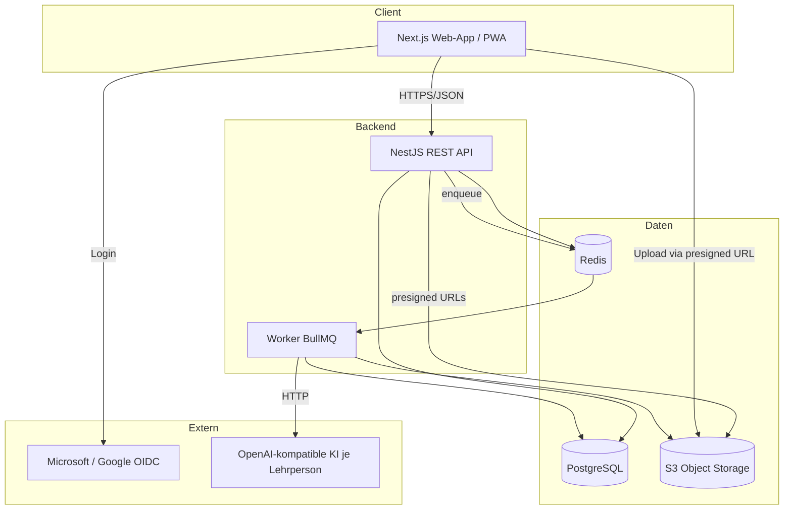
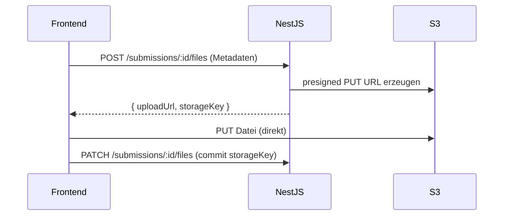
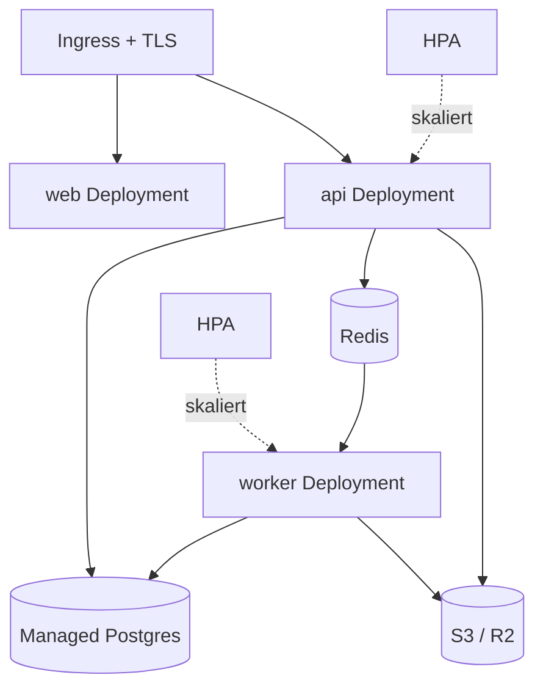

# 06 – Architektur

## 1. Technologie-Stack

| Schicht        | Technologie                                              | Begründung                                |
| -------------- | -------------------------------------------------------- | ----------------------------------------- |
| Frontend       | **Next.js (React) + TypeScript**                         | SSR/SSG, gute DX, PWA-fähig, i18n-Support |
| UI             | Tailwind CSS + shadcn/ui (Radix)                         | schnelle, konsistente, barrierearme UI    |
| State/Data     | TanStack Query                                           | Server-State, Caching                     |
| Backend        | **NestJS (Node.js) + TypeScript**                        | modular, DI, gut strukturierbar, OpenAPI  |
| ORM            | Prisma                                                   | typsicher, Migrationen, PostgreSQL-First  |
| Datenbank      | **PostgreSQL**                                           | relational, JSONB für i18n/config         |
| Objektspeicher | **S3-kompatibel** (MinIO lokal / AWS S3 / Cloudflare R2) | Dokumenten-Uploads, Archive               |
| Auth           | OIDC via **NextAuth.js** + Microsoft & Google            | Standard-Provider                         |
| KI             | OpenAI-kompatibler HTTP-Client                           | konfigurierbar pro Lehrperson             |
| Jobs           | BullMQ (Redis)                                           | asynchrone KI-Calls, Exporte, Mailversand |
| Realtime       | WebSocket (Socket.IO) optional                           | Live-Dashboard, Fachgespräch-Streaming    |

## 2. Systemüberblick



## 3. Backend-Modulschnitt (NestJS)

```
src/
  auth/            # OIDC, Sessions/JWT, Guards (RBAC)
  tenants/         # Mandanten
  users/           # Benutzer, Memberships
  modules/         # Module, Handlungsziele
  matrices/        # Kompetenzmatrix, Bänder, Felder, Deskriptoren
  evidence/        # Kompetenznachweise, Quiz, Rubrics
  classes/         # Klassen, JoinCodes, Enrollments
  submissions/     # Einreichungen, Files (presigned), Status-Workflow
  evaluations/     # Bewertungen, Rückweisung, Noten
  learning-paths/  # Lernpfade
  ai/              # AiConfig, Grading, Expert-Talk (Worker)
  dashboard/       # Aggregationen, Reporting
  export-import/   # Matrix-/Klassen-Pakete
  storage/         # S3-Abstraktion
  i18n/            # Übersetzungslogik
  common/          # Guards, Interceptors, DTOs, Errors
```

## 4. Frontend-Struktur (Next.js App Router)

```
app/
  (auth)/login
  (teacher)/dashboard, modules, matrices, classes, evidence, ai-settings, evaluate
  (student)/matrix, learning-path, evidence/[id], expert-talk
components/  ui (shadcn), matrix-grid, progress-heatmap, evidence-forms
lib/        api-client, auth, i18n
```

## 5. Dateiupload-Konzept (S3 presigned)



> Vorteil: grosse Dateien gehen direkt zu S3, API bleibt schlank.

## 6. Deployment

| Umgebung     | Setup                                                                                                       |
| ------------ | ----------------------------------------------------------------------------------------------------------- |
| Lokal/Dev    | Docker Compose: Postgres, Redis, MinIO, API, Web                                                            |
| Staging/Prod | Container (Docker) auf Kubernetes oder PaaS; Managed Postgres; S3/R2; Reverse Proxy (Traefik/Nginx) mit TLS |
| CI/CD        | GitHub Actions: Lint, Test, Build, Migrate, Deploy                                                          |

```mermaid
graph LR
  subgraph docker-compose (Dev)
    a[web: next] --- b[api: nestjs]
    a2[worker: bullmq] --- d
    b --- c[(postgres)]
    b --- d[(redis)]
    b --- e[(minio)]
  end
```

### 6.1 Container-Images

Drei schlanke, zustandslose Images (Multi-Stage-Builds), per Tag versioniert:

| Image    | Inhalt                           | Skalierung                 |
| -------- | -------------------------------- | -------------------------- |
| `web`    | Next.js (SSR/PWA)                | horizontal                 |
| `api`    | NestJS REST API                  | horizontal (stateless)     |
| `worker` | BullMQ-Worker (KI, Export, Mail) | horizontal nach Queue-Last |

Konfiguration ausschliesslich über Env-Variablen/Secrets (12-Factor). Persistenz liegt extern
(Managed Postgres, S3/R2) – Container halten keine Daten.

### 6.2 Kubernetes (Staging/Prod)

- **Deployments** für `web`, `api`, `worker`; **Service** + **Ingress** (Traefik/Nginx, TLS).
- **Liveness/Readiness-Probes** (`/healthz`, `/readyz`) je Service.
- **HPA** für `api` und `worker` (CPU/Queue-Tiefe).
- **DB-Migrationen** als Init-/Job-Container (Prisma Migrate) vor dem Rollout.
- **Secrets** via Kubernetes-Secrets/External-Secrets (KMS); Postgres & Objektspeicher gemanagt.
- Auslieferung als **Helm-Chart** oder Kustomize-Overlays (dev/staging/prod).



> Detaillierte NFR siehe [12-NFR](./12-nicht-funktionale-anforderungen.md) Abschnitt 8
> (Portabilität & Deployment, NFR-PO1..PO8).

## 7. Mandantenfähigkeit (Multi-Tenancy)

- **Shared DB, Tenant-Spalte** (`tenantId` auf allen mandantenbezogenen Tabellen).
- Row-Level-Filter via NestJS-Interceptor/Prisma-Middleware erzwingt `tenantId`-Scope.
- Skalierbar; bei Bedarf später Schema-Trennung.

## 8. Zentrale Querschnittsthemen

| Thema        | Lösung                                         |
| ------------ | ---------------------------------------------- |
| Validierung  | class-validator DTOs                           |
| Fehlerformat | RFC 7807 (problem+json)                        |
| API-Doku     | OpenAPI/Swagger automatisch                    |
| Logging      | strukturiert (pino), Correlation-ID            |
| Secrets      | Env + verschlüsselte AiConfig-Tokens (KMS/lib) |
| Tests        | Unit (Jest), E2E (Playwright)                  |
