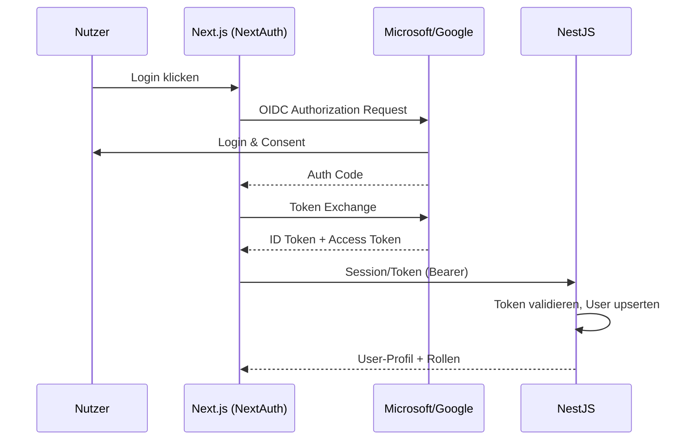
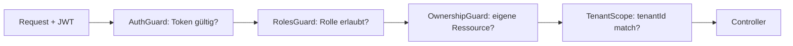

# 08 – Authentifizierung & Autorisierung

## 1. Login via OIDC (Microsoft & Google)

Login erfolgt ausschliesslich über externe Identity-Provider (OpenID Connect):
- **Microsoft** (Azure AD / Entra ID, persönliche & Schul-/Org-Konten)
- **Google** (Workspace & private Konten)

Umsetzung im Frontend mit **NextAuth.js** (oder Auth.js). Das Backend (NestJS) validiert das
ID-/Access-Token bzw. eine vom BFF ausgestellte Session.

## 2. Benutzer-Provisionierung (JIT)
- Beim ersten Login wird `User` per **Just-in-Time** angelegt (Mapping über
  `authProvider` + `externalId`, E-Mail).
- Rolle pro Tenant via `Membership`.
- **Rollenzuweisung:**
  - Lehrpersonen: per Einladung, Domain-Whitelist oder Admin-Freigabe.
  - Lernende: erhalten Rolle `student` automatisch; werden über Beitrittscode einer Klasse zugeordnet.

## 3. Sessions & Tokens
- **BFF-Pattern**: NextAuth hält die Session (httpOnly Secure Cookie). Das Frontend ruft die
  NestJS-API mit einem kurzlebigen **JWT** auf (im Cookie/Authorization-Header).
- Token enthält: `userId`, `tenantId`, `roles`, `locale`, `exp`.
- Refresh über Session; kurze Token-Lebensdauer (z.B. 15 min) + Rotation.

## 4. Autorisierung (RBAC)
- NestJS **Guards** + Decorator `@Roles('teacher')`.
- Ressourcen-Ownership prüfen (Lehrperson nur eigene Module/Klassen).
- **Tenant-Scope** erzwingen (Interceptor/Prisma-Middleware filtert `tenantId`).
- Berechtigungsmatrix → [02-Rollen](./02-rollen-und-use-cases.md).

## 5. Sicherheitsmassnahmen
| Thema | Massnahme |
|-------|-----------|
| Transport | TLS überall (HSTS) |
| Cookies | httpOnly, Secure, SameSite=Lax/Strict |
| CSRF | CSRF-Token für state-changing Requests (bei Cookie-Auth) |
| Token-Speicherung | keine Tokens im localStorage |
| Secrets | KI-Tokens (`AiConfig.apiKey`) verschlüsselt at rest |
| Rate Limiting | auf Login, Join-Code, KI-Endpunkte |
| Audit | Login-/Bewertungs-Events protokolliert |
| Least Privilege | Lernende sehen nur eigene Daten + freigegebene Nachweise |

## 6. Konfigurationsbedarf (Setup)
- Azure App Registration (Client-ID/Secret, Redirect-URIs, Scopes `openid profile email`).
- Google OAuth Client (Client-ID/Secret, Redirect-URIs).
- Env-Variablen: `NEXTAUTH_SECRET`, Provider-Credentials, `JWT_SIGNING_KEY`.
