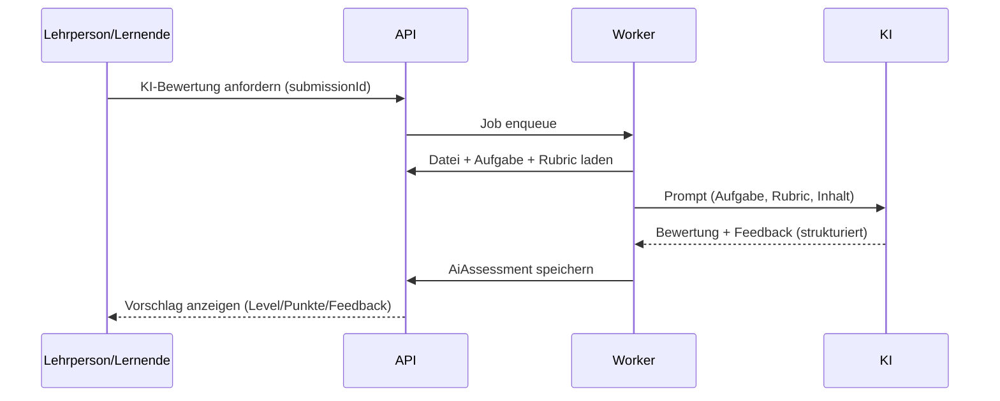
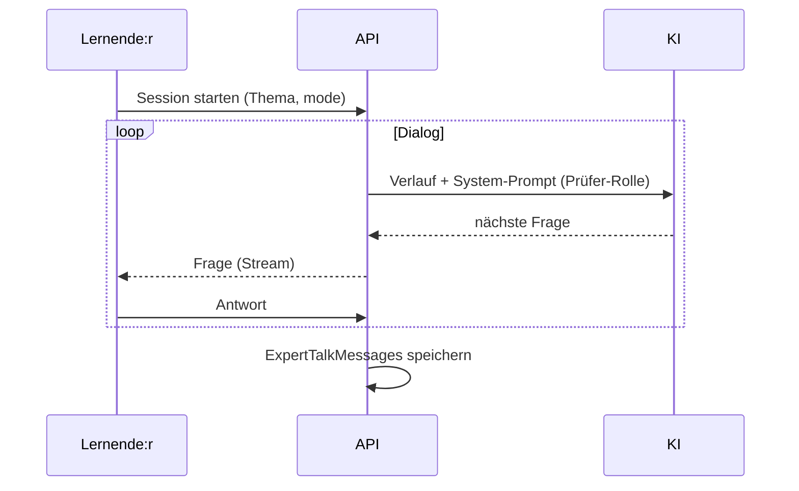

# 09 – KI-Konzept

Die KI unterstützt **Bewertung**, **Feedback** und **Fachgespräch** – immer als Hilfsmittel,
nie als finale Instanz. **Grundsatz:** Die Lehrperson behält die Bewertungshoheit (FA-85).

## 1. KI-Konfiguration (pro Lehrperson)
- OpenAI-kompatible Schnittstelle: `baseUrl`, `apiKey`, `model`, `temperature`, `extraParams`.
- Test-Endpoint prüft Erreichbarkeit/Modell.
- Schalter: `enabledForGrading`, `enabledForExpertTalk`.
- Token verschlüsselt gespeichert; lernortspezifischer Endpoint möglich (Datenschutz).

## 2. Anwendungsfälle

### 2.1 KI-Korrektur von Uploads

- Eingabe: Aufgabenstellung, Bewertungsraster/Leistungsziele, eingereichter Inhalt (Text/Datei extrahiert).
- Ausgabe: strukturiert (JSON) – `suggestedLevel`, `suggestedPoints`, `feedback`, Begründung je Kriterium.
- Lehrperson kann **übernehmen** oder **überschreiben**.

### 2.2 KI-Feedback für Lernende
- Nach Einreichung optional sofortiges Feedback („aus Sicht der KI korrekt/nicht, woran liegt es").
- Klar als KI-Hinweis gekennzeichnet, keine Note.

### 2.3 Fachgespräch (Expert Talk)

- Modus `practice` (üben, kein Eintrag in Bewertung) oder `assessment` (Lehrperson sieht Verlauf).
- KI agiert als wohlwollende:r Prüfer:in zum vorgegebenen Thema.
- Optional: KI-Zusammenfassung/Bewertungsvorschlag am Ende.

## 3. Prompt-Design (Leitlinien)
- **System-Prompt** definiert Rolle, ICT-BBCH-Kontext, Gütestufen-Definitionen.
- **Strukturierte Ausgabe** (JSON-Schema/Function-Calling) für maschinelle Weiterverarbeitung.
- Bewertungsraster wird als Kontext mitgegeben → KI bewertet entlang der Indikatoren.
- Sprache gemäss `locale` der Lernenden.

Beispiel-Skizze (Grading):
```text
System: Du bist Fachexperte:in für ICT-Grundbildung. Bewerte streng anhand des Rasters.
        Gütestufen: Beginner/Intermediate/Advanced (Definitionen ...).
User:   Aufgabe: {instructions}
        Bewertungsraster: {rubric}
        Abgabe: {content}
        Gib JSON zurück: { level, points, feedback, perCriterion[] }
```

## 4. Datenschutz bei KI (siehe auch [12-NFR](./12-nicht-funktionale-anforderungen.md))
| Massnahme | Beschreibung |
|-----------|--------------|
| Opt-in | KI-Nutzung pro Lehrperson/Klasse aktiv einschalten |
| Transparenz | Lernende sehen, wann KI involviert ist |
| Minimierung | nur notwendige Inhalte an KI; Namen/PII möglichst entfernen |
| Eigener Endpoint | lernort-eigene/EU-/CH-gehostete KI möglich |
| Speicherung | Roh-Antworten (`rawResponse`) nur intern, löschbar |
| Kein Auto-Grading | KI-Ergebnis nie automatisch als Endnote |

## 5. Kosten & Robustheit
- Asynchrone Verarbeitung (BullMQ), Retry mit Backoff.
- Timeout/Fallback bei KI-Ausfall (Lehrperson bewertet manuell).
- Token-/Kostenlogging je Tenant (optional Limits).
