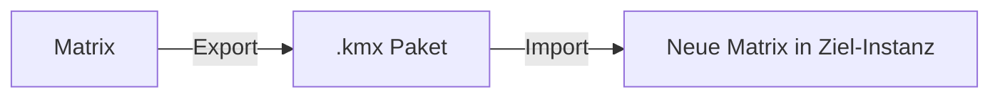
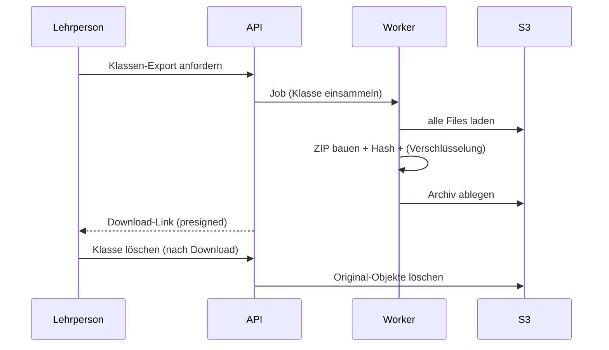

# 10 – Export & Import

Zwei Hauptfälle: **(A) Matrix-Wiederverwendung** und **(B) Klassen-Archivierung**.

## 1. Matrix-Export/-Import (Wiederverwendung)

Ziel: Eine erstellte Kompetenzmatrix inkl. Nachweisen in einer anderen Instanz/Konto nutzen.

**Paketinhalt (`.kmx`, ZIP):**
```
matrix-export/
  manifest.json        # Version, Schema, Quelle, Datum
  module.json          # Modul, Handlungsziele
  matrix.json          # Bänder, Felder, Deskriptoren, Gewichtung (i18n)
  evidence.json        # Kompetenznachweise, Rubrics, Quiz-Configs
  learning-paths.json  # optionale Lernpfade
  assets/              # ggf. Aufgaben-Anhänge (keine Lernenden-Daten!)
```
- **Keine** personenbezogenen Daten (keine Lernenden, keine Submissions).
- Import erzeugt neue IDs, hängt Matrix an importierenden Tenant/Lehrperson.
- Schema-Version im Manifest → Migration bei Versionssprung.



## 2. Klassen-Archiv-Export/-Import (Archivierung)

Ziel: Abgeschlossene Klasse inkl. **aller Lernenden-Dokumente** exportieren, Klasse danach
löschen (Speicherplatz), im Streitfall reimportieren.

**Paketinhalt (`.kmc`, ZIP – ggf. verschlüsselt):**
```
class-archive/
  manifest.json        # Version, Klasse, Zeitraum, Hash
  class.json           # Klasse, zugeordnete Matrizen (Snapshot)
  enrollments.json     # Lernende (pseudonymisierbar)
  submissions.json     # Einreichungen, Status, Bewertungen, Feedback
  expert-talks.json    # Fachgespräch-Verläufe
  files/               # alle hochgeladenen Dokumente (aus S3)
```
- Enthält **personenbezogene Daten** → verschlüsseltes Archiv empfohlen, DSG-konform aufbewahren.
- Nach erfolgreichem Export (Integritäts-Hash geprüft) kann Klasse hart gelöscht werden
  (inkl. S3-Objekte).
- Reimport stellt Klasse **read-only** wieder her (Einsicht im Streitfall).



## 3. Integrität & Sicherheit
| Thema | Massnahme |
|-------|-----------|
| Integrität | SHA-256-Hash im Manifest |
| Versionierung | `schemaVersion` im Manifest, Migrationspfad |
| Verschlüsselung | Klassen-Archive optional passwort-/key-verschlüsselt |
| Zugriff | nur Eigentümer-Lehrperson/Admin |
| Audit | Export-/Lösch-Events protokolliert |

## 4. Formate-Zusammenfassung
| Paket | Endung | Enthält PII? | Zweck |
|-------|--------|--------------|-------|
| Matrix-Export | `.kmx` | nein | Wiederverwendung von Matrizen/Nachweisen |
| Klassen-Archiv | `.kmc` | ja | Archivierung/Löschung, Streitfall-Reimport |
