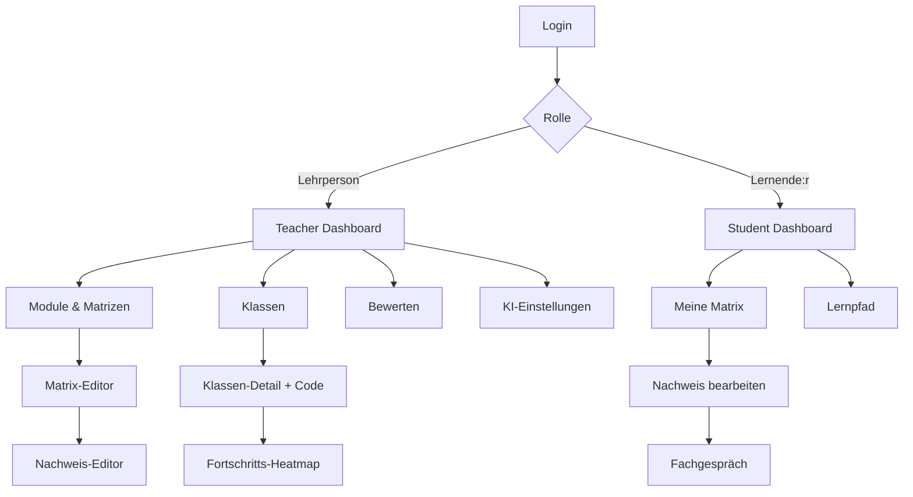
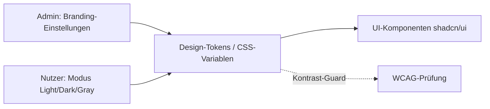

# 11 – UI/UX-Konzept

Responsive Web-App (Desktop-first für Lehrpersonen, mobile-tauglich für Lernende). PWA-fähig.
Mehrsprachig (DE/FR/IT/EN). Barrierearm (Kontrast, Tastaturbedienung, ARIA).

**Designhaltung:** schlicht, ruhig und modern – viel Weissraum, klare Typografie, dezente
Schatten/Radii, Inhalt vor Dekoration. Keine überladenen Oberflächen; Funktion und Lesbarkeit
stehen im Vordergrund.

## 1. Informationsarchitektur



## 2. Hauptscreens – Lehrperson

### 2.1 Matrix-Editor

- Tabellarische Ansicht: Zeilen = Kompetenzbänder, Spalten = Beginner/Intermediate/Advanced.
- Zelle = Kompetenzfeld mit Deskriptor; Inline-Edit; Badge `A1B`.
- Seitenspalte: Handlungsziele (per Drag&Drop einem Band zuordnen).
- Gewichtung je Band editierbar; Validierungs-Hinweise (HZ-Abdeckung, 80%).

```
┌───────────────────────────────────────────────────────────┐
│ Modul 293  [Entwurf ▾]   [Validieren] [Duplizieren] [⇩.kmx]│
├──────────┬───────────┬───────────────┬────────────────────┤
│ Band/HZ  │ Beginner  │ Intermediate  │ Advanced           │
├──────────┼───────────┼───────────────┼────────────────────┤
│ A1 (HZ1) │ A1B Ich…  │ A1I Ich…      │ A1A Ich…           │
│ B1 (HZ3) │ B1B Ich…  │ B1I Ich…      │ B1A Ich…           │
└──────────┴───────────┴───────────────┴────────────────────┘
```

### 2.2 Nachweis-Editor

- Typ wählen (Quiz/Upload/Upload+KI/Fachgespräch).
- Kompetenzfeld(er) zuordnen, Sichtbarkeit-Toggle, Ablaufdatum, Punkte/Ziel-Gütestufe.
- Bewertungsraster-Builder (Kriterien + Indikatoren je Stufe) oder Leistungsziele.

### 2.3 Fortschritts-Heatmap (Dashboard)

- Matrix: Zeilen = Lernende, Spalten = Kompetenzbänder/-felder.
- Farbe = Status/Gütestufe (grau offen, gelb eingereicht, grün bewertet, rot zurückgewiesen).
- Klick → Drilldown auf Lernende:r; Badge mit Anzahl offener Bewertungen.

### 2.4 Bewertungs-Ansicht

- Geteilte Ansicht: links Abgabe (Dokument-Viewer/Quiz/Gesprächsverlauf), rechts Bewertung.
- Buttons: „KI-Vorschlag holen", „Bewerten", „Zurückweisen".
- Felder: Gütestufe/Punkte, Feedback, Begründung.

## 3. Hauptscreens – Lernende

### 3.1 Meine Matrix / Lernpfad (Umschalter)

- Matrix-Ansicht analog, aber pro Feld Status-Badge + Aufgaben.
- Lernpfad-Ansicht: geführte Schritte (Stepper), Fortschrittsbalken.

### 3.2 Nachweis bearbeiten

- Aufgabenstellung, Eingabe je Typ (Quiz, Upload-Dropzone, Texteditor).
- „Einreichen"; nach Einreichung optional KI-Feedback.
- Status & ggf. Rückweisungsgrund sichtbar.

### 3.3 Fachgespräch

- Chat-UI mit KI; Modus „Üben" gekennzeichnet.
- Verlauf scrollbar; Ende-Button.

## 4. Designprinzipien

| Prinzip     | Umsetzung                                                |
| ----------- | -------------------------------------------------------- |
| Klarheit    | Status-Farben konsistent, sprechende Badges (A1B)        |
| Effizienz   | Inline-Edit, Tastatur-Shortcuts, Bulk-Bewertung          |
| Transparenz | Fortschritt jederzeit sichtbar; KI klar gekennzeichnet   |
| Konsistenz  | Design-System (shadcn/ui), wiederverwendbare Komponenten |
| Mobile      | Lernenden-Flows touch-optimiert, responsive              |
| A11y        | WCAG 2.1 AA: Kontrast, Fokus, ARIA, Skalierung           |

## 5. Statusfarben (Legende)

| Status                     | Farbe                              |
| -------------------------- | ---------------------------------- |
| Offen                      | Grau                               |
| Eingereicht / In Bewertung | Gelb                               |
| Bewertet                   | Grün (Schattierung nach Gütestufe) |
| Zurückgewiesen             | Rot                                |
| Abgelaufen                 | Dunkelgrau                         |

> Statusfarben werden nie **allein** zur Bedeutungsvermittlung genutzt (A11y): immer kombiniert
> mit Icon und/oder Textlabel, damit auch bei Farbsehschwäche eindeutig.

## 6. Theming, Modi & Branding

Die App nutzt ein **Design-Token-System** (CSS-Variablen, über shadcn/ui + Tailwind). Alle
Farben, Abstände, Radii und Schatten sind Tokens – dadurch sind Modi-Wechsel und Schul-Branding
ohne Code-Änderung möglich.

### 6.1 Anzeige-Modi (vom Nutzer wählbar)

| Modus     | Beschreibung                                                                           |
| --------- | -------------------------------------------------------------------------------------- |
| **Light** | Heller Hintergrund, dunkle Schrift. Standard.                                          |
| **Dark**  | Dunkler Hintergrund, helle Schrift; augenschonend bei wenig Licht.                     |
| **Gray**  | Gedämpfte, neutrale Graustufen-Palette (minimaler Farbeinsatz, sehr ruhig/fokussiert). |

- Auswahl pro Nutzer:in im Profil; Default = **System** (`prefers-color-scheme`).
- Persistenz: in `User.settings`/LocalStorage; kein Flash beim Laden (SSR-fähig).
- Alle drei Modi erfüllen Kontrastvorgaben (siehe 6.4); Status- und Branding-Farben werden je
  Modus auf kontrastsichere Varianten gemappt.

### 6.2 Schul-Branding (durch Admin konfigurierbar)

Pro Mandant (Schule) kann der/die **Admin** ein leichtgewichtiges Branding setzen:

| Einstellung               | Beschreibung                                                       |
| ------------------------- | ------------------------------------------------------------------ |
| **Primärfarbe**           | Akzentfarbe (Buttons, Links, aktive Zustände), passend zur Schule. |
| **Sekundär-/Akzentfarbe** | optional, für Highlights.                                          |
| **Logo (Light/Dark)**     | Upload (SVG/PNG); je eine Variante für helle/dunkle Hintergründe.  |
| **Favicon**               | optional, aus Logo ableitbar.                                      |
| **App-/Schulname**        | Anzeigename in Kopfzeile/Title.                                    |

- Branding-Farben werden als Tokens injiziert und **automatisch auf alle drei Modi** angepasst.
- **Kontrast-Guard:** Beim Speichern prüft das System das Kontrastverhältnis (Text auf
  Primärfarbe ≥ 4.5:1). Bei Unterschreitung Warnung + automatisch abgeleiteter, barrierefreier
  Vordergrund-/Hover-Ton.
- Logo-Upload via S3 (presigned), Typ-/Grössenprüfung; Vorschau in allen Modi.



### 6.3 Token-Beispiel (CSS-Variablen)

```css
:root {
  /* Light */
  --color-bg: #ffffff;
  --color-fg: #0f172a;
  --color-primary: var(--brand-primary, #2563eb); /* Schul-Override */
  --radius: 0.5rem;
}
[data-theme='dark'] {
  --color-bg: #0b0f17;
  --color-fg: #e5e7eb;
}
[data-theme='gray'] {
  --color-bg: #f3f4f6;
  --color-fg: #1f2937;
  --color-primary: #4b5563; /* entsättigt */
}
```

### 6.4 Barrierefreiheit (WCAG 2.1 AA)

- **Kontrast:** Text ≥ 4.5:1, grosse Schrift/Icons ≥ 3:1 – in allen Modi und für Branding-Farben.
- **Tastatur:** alle Funktionen ohne Maus bedienbar; sichtbarer Fokus-Ring (Token-basiert).
- **Screenreader:** semantisches HTML, ARIA-Rollen/-Labels, Live-Regions für Status-Updates.
- **Bedeutung nicht nur über Farbe:** Icon + Text zusätzlich (siehe Hinweis bei Statusfarben).
- **Skalierung:** Layout bis 200% Zoom nutzbar; relative Einheiten (rem).
- **Bewegung:** `prefers-reduced-motion` respektieren (Animationen reduzieren).
- **Logos:** sinnvoller Alt-Text; dekorative Grafiken `aria-hidden`.
