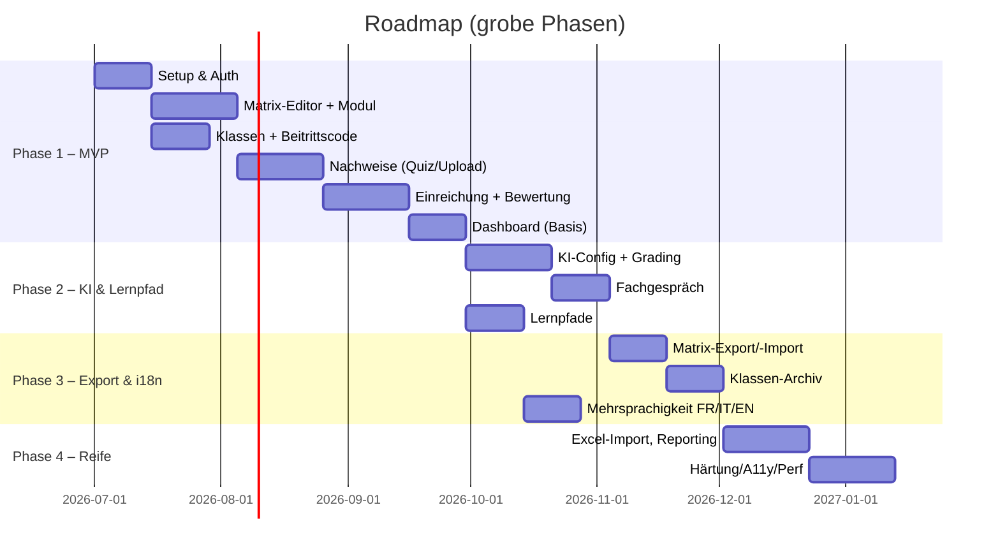

# 13 – Roadmap & MVP

## 1. Priorisierung (MoSCoW → Phasen)

## 2. MVP-Scope (Phase 1)

**Ziel:** Ein:e Lehrperson kann eine Matrix erstellen, eine Klasse mit Code führen, Quiz-/Upload-
Nachweise definieren; Lernende treten bei, reichen ein; Lehrperson bewertet; Basis-Dashboard.

| Bereich | MVP enthält | Referenz FA |
|---------|-------------|-------------|
| Auth | Login Microsoft/Google, Rollen | 08 |
| Modul/Matrix | Modul, HZ, Bänder, Felder, Deskriptoren | FA-01..04 |
| Klassen | Klasse, Matrix-Zuordnung, Beitrittscode, Mitglieder | FA-20..25 |
| Nachweise | Quiz + Upload, Sichtbarkeit, Ablaufdatum, Punkte | FA-30,32,33,36,37,40 |
| Lernende | Matrix sehen, einreichen, Status | FA-50,51,53,55 |
| Bewertung | Punkte/Level, Feedback, Zurückweisen | FA-60..63 |
| Dashboard | Fortschritts-Heatmap (Basis) | FA-90,91,92 |

**Im MVP zusätzlich (Muss):** Bewertungshistorie/Audit (FA-65), Login Microsoft/Google,
mind. UI-Sprache DE (i18n-fähig vorbereitet), Docker-Lauffähigkeit.

**Nicht im MVP:** KI, Fachgespräch, Lernpfade, Export/Import, vollständige FR/IT/EN-Übersetzung,
Excel-Import.

## 3. Folgephasen

| Phase | Inhalt | Wichtige FA |
|-------|--------|-------------|
| 2 | KI-Config, KI-Grading, KI-Feedback, Fachgespräch, Lernpfade | FA-34,35,70..72,80..85 |
| 3 | Matrix-Export/-Import, Klassen-Archiv, Mehrsprachigkeit | FA-100..104, FA-10 |
| 4 | Excel-Import, erweitertes Reporting/Filter, Härtung, A11y, Performance | FA-11,93,94 |

## 4. Definition of Done (pro Feature)
- Akzeptanzkriterien erfüllt (FA-Referenz), Tests grün (Unit/E2E).
- RBAC & Tenant-Scope geprüft.
- i18n-fähig (mind. DE), responsive.
- Doku/OpenAPI aktualisiert.
- Code-Review + CI grün.

## 5. Offene Entscheidungen / nächste Schritte
| # | Offene Frage | Empfehlung |
|---|--------------|------------|
| 1 | Betriebsmodell: Single- vs. Multi-Tenant von Beginn an? | Multi-Tenant-fähiges Schema, Start mit 1 Tenant. |
| 2 | i18n-Speicherung: JSONB vs. Translation-Tabelle | MVP: JSONB; später evaluieren. |
| 3 | Notenstrategie-Defaults pro Schule | Default ICT-BBCH-Richtwerte, konfigurierbar. |
| 4 | Hosting/Datenstandort (CH/EU) | Vor Pilot festlegen (Datenschutz). |
| 5 | KI-Provider-Default | Lehrperson bringt eigenen Endpoint; optional zentraler Default. |
| 6 | Excel-Template-Mapping | Felder des ICT-BBCH-Templates analysieren (Phase 4). |

## 6. Empfohlenes weiteres Vorgehen
1. **Diese Planung reviewen** und offene Entscheidungen (Abschnitt 5) klären.
2. **Klickbares UI-Mockup** für Matrix-Editor + Dashboard erstellen (Validierung mit Lehrpersonen).
3. **Datenmodell als Prisma-Schema** ableiten, erste Migration.
4. **MVP-Walking-Skeleton**: Auth → Matrix → Klasse → Nachweis → Einreichung → Bewertung.
5. **Pilot** mit einem Modul (z.B. 293) und einer realen Klasse.
