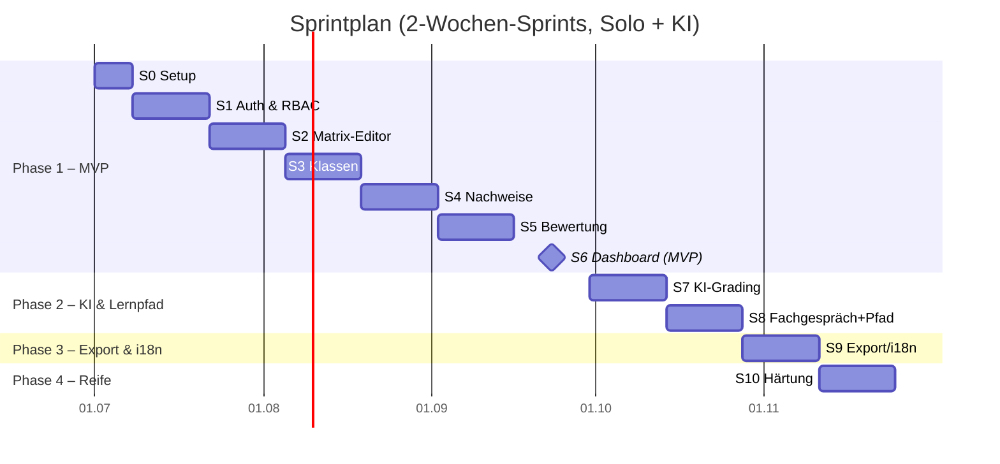

# 14 – Sprintplan (Solo + KI-gestütztes „Vibe-Coding")

> **Annahmen:** 1 Entwickler:in, KI-gestützte Entwicklung (Cline/Copilot/Claude),
> **2-Wochen-Sprints**. Aufwände abgeleitet aus [Roadmap (Doc 13)](./13-roadmap-und-mvp.md).
> Aufgrund der KI-Unterstützung ist pro Sprint etwas mehr Inhalt eingeplant als bei klassischer
> Schätzung. Reihenfolge = empfohlener Build-Order (Walking-Skeleton zuerst).

---

## 1. Überblick

| Sprint | Dauer    | Ziel                                                       | Phase   | FA-Referenz          |
| ------ | -------- | ---------------------------------------------------------- | ------- | -------------------- |
| **0**  | 1 Woche  | Projekt-Setup, CI/CD, Docker, DB-Schema-Gerüst             | –       | –                    |
| **1**  | 2 Wochen | Auth & RBAC, Multi-Tenant-Fundament                        | 1 (MVP) | 08                   |
| **2**  | 2 Wochen | Matrix-Editor (Modul, HZ, Bänder, Felder, Deskriptoren)    | 1 (MVP) | FA-01..04            |
| **3**  | 2 Wochen | Klassen + Beitrittscode + Mitglieder                       | 1 (MVP) | FA-20..25            |
| **4**  | 2 Wochen | Nachweise: Quiz + Upload, Sichtbarkeit, Ablauf, Punkte     | 1 (MVP) | FA-30,32,33,36,37,40 |
| **5**  | 2 Wochen | Einreichung + Bewertung + Feedback + Zurückweisen + Audit  | 1 (MVP) | FA-50..55, 60..65    |
| **6**  | 2 Wochen | Dashboard (Fortschritts-Heatmap Basis) → **MVP fertig 🎯** | 1 (MVP) | FA-90..92            |
| **7**  | 2 Wochen | KI-Config, KI-Grading, KI-Feedback                         | 2       | FA-34,35,70..72      |
| **8**  | 2 Wochen | KI-Fachgespräch + Lernpfade                                | 2       | FA-80..85            |
| **9**  | 2 Wochen | Export/Import, Klassen-Archiv, Mehrsprachigkeit FR/IT/EN   | 3       | FA-100..104, FA-10   |
| **10** | 2 Wochen | Excel-Import, Reporting/Filter, Härtung, A11y, Performance | 4       | FA-11, 93, 94        |

**Gesamtdauer:**

- **MVP (Sprint 0–6):** ~13 Wochen ≈ **3 Monate** (Vollzeit) – pilotfähig.
- **Komplett (Sprint 0–10):** ~23 Wochen ≈ **5 Monate** (Vollzeit).
- _Nebenberuflich (~10 h/Woche):_ Kalenderzeit ca. **×2–3**.

---

## 2. Sprintdetails

### Sprint 0 – Setup & Walking-Skeleton-Gerüst _(1 Woche)_

**Ziel:** Lauffähiges, leeres Grundgerüst – „Hello World" über alle Schichten.

- Repo-Struktur (Backend/Frontend/Infra), Lint/Format, CI (GitHub Actions).
- Docker-Compose (App + DB), `.env`-Schema.
- Prisma-Schema-Grundgerüst aus [Datenmodell (Doc 05)](./05-datenmodell.md), erste Migration.
- Health-Endpoint + leere Startseite, die vom Backend ausgeliefert wird.

**Vibe-Coding-Hinweis:** Erst Architektur-/Stack-Entscheid fixieren (siehe Doc 06), dann
KI ein konsistentes Gerüst generieren lassen. Klein starten, sofort lauffähig halten.

**DoD:** `docker compose up` startet App + DB, CI grün, eine Migration angewandt.

### Sprint 1 – Auth & RBAC _(2 Wochen)_

**Ziel:** Login + Rollen + Mandantentrennung.

- OAuth/OIDC (Microsoft, Google) gemäß [Doc 08](./08-authentifizierung.md).
- Rollenmodell (Lehrperson/Lernende:r/Admin), RBAC-Middleware.
- Multi-Tenant-fähiges Schema (1 Tenant aktiv), Tenant-Scope in Queries.

**DoD:** Login funktioniert, geschützte Routen, Rolle steuert Sichtbarkeit, Audit-Basis.

### Sprint 2 – Matrix-Editor _(2 Wochen)_

**Ziel:** Lehrperson erstellt/bearbeitet eine Kompetenzmatrix.

- Modul + Modulidentifikation, Handlungsziele.
- Kompetenzbänder × Gütestufen, Kompetenzfelder, Deskriptoren („Ich kann …").
- Referenz: [Fachkonzept (Doc 03)](./03-fachkonzept-kompetenzmatrix.md), FA-01..04.

**DoD:** Matrix anlegen, editieren, speichern; Mockup `lehrer-module.html` als UI-Vorlage.

### Sprint 3 – Klassen & Beitrittscode _(2 Wochen)_

**Ziel:** Klassen führen, Lernende per Code beitreten.

- Klasse anlegen, Matrix zuordnen, Beitrittscode generieren, Mitgliederliste (FA-20..25).

**DoD:** Lernende:r tritt mit Code bei, erscheint in Klasse; Mockup `lehrer-klassen.html`.

### Sprint 4 – Nachweise (Quiz + Upload) _(2 Wochen)_

**Ziel:** Kompetenznachweise definieren.

- Quiz (Fragen/Auswertung) + Upload-Nachweis, Sichtbarkeit, Ablaufdatum, Punkte (FA-30,32,33,36,37,40).

**DoD:** Nachweis je Kompetenzfeld erstellen; Mockups `lernende-quiz.html`, `lernende-nachweis.html`.

### Sprint 5 – Einreichung & Bewertung _(2 Wochen)_

**Ziel:** Kern-Workflow schließen.

- Lernende:r reicht ein, sieht Status (FA-50..55).
- Lehrperson bewertet (Punkte/Level), Feedback, Zurückweisen, Bewertungshistorie/Audit (FA-60..65).

**DoD:** Voller Loop Einreichen→Bewerten→Status; Mockup `lehrer-bewerten.html`.

### Sprint 6 – Dashboard (MVP-Abschluss) 🎯 _(2 Wochen)_

**Ziel:** Überblick + Pilot-Reife.

- Fortschritts-Heatmap (Basis), Kennzahlen, Bewertungs-Queue (FA-90..92).
- MVP-Polish, Bugfixing, Pilot mit Modul 293 vorbereiten.

**DoD:** MVP-Scope aus Doc 13 §2 vollständig; Mockup `lehrer-dashboard.html`; **pilotfähig**.

### Sprint 7 – KI-Grading _(2 Wochen)_

**Ziel:** KI unterstützt Bewertung.

- KI-Konfiguration (Endpoint je Lehrperson), KI-Bewertungsvorschlag, KI-Feedback, Override (FA-34,35,70..72).
- Referenz: [KI-Konzept (Doc 09)](./09-ki-konzept.md).

**DoD:** KI-Vorschlag sichtbar, Lehrperson kann überschreiben; Mockup `lehrer-ki.html`.

### Sprint 8 – Fachgespräch & Lernpfade _(2 Wochen)_

**Ziel:** KI-Dialog + alternative Reihenfolge.

- KI-Fachgespräch (Übungsmodus), Lernpfade (didaktische Reihenfolge) (FA-80..85).

**DoD:** Fachgespräch-Dialog läuft; Lernpfad steuert Reihenfolge; Mockups `lernende-fachgespraech.html`, `lernende-lernpfad.html`.

### Sprint 9 – Export & i18n _(2 Wochen)_

**Ziel:** Datenportabilität + Mehrsprachigkeit.

- Matrix-Export/-Import, Klassen-Archiv (FA-100..104), FR/IT/EN-Übersetzung (FA-10).
- Referenz: [Export/Import (Doc 10)](./10-export-import.md).

**DoD:** Export/Import rundtrip-fähig; UI in DE/FR/IT/EN umschaltbar.

### Sprint 10 – Reife & Härtung _(2 Wochen)_

**Ziel:** Produktionsreife.

- Excel-Import (ICT-BBCH-Template), erweitertes Reporting/Filter (FA-11,93,94).
- Sicherheit, A11y, Performance gemäß [Doc 12](./12-nicht-funktionale-anforderungen.md).

**DoD:** NFR erfüllt, A11y-Check grün, Lasttest ok.

---

## 3. Story-Points / Velocity (Orientierung)

Skala (Fibonacci): 1 = trivial, 2 = klein, 3 = mittel, 5 = groß, 8 = sehr groß.
Erwartete Solo-Velocity mit KI: **~15–20 Punkte / 2-Wochen-Sprint**. Nach 2–3 Sprints die
tatsächliche Velocity aus dem GitHub-Project-Insights ablesen und nachjustieren.

---

## 4. Definition of Done (global, pro Issue)

- Akzeptanzkriterien (FA-Referenz) erfüllt, Tests grün (Unit/E2E wo sinnvoll).
- RBAC & Tenant-Scope geprüft.
- i18n-fähig (mind. DE), responsive.
- Doku/OpenAPI aktualisiert.
- CI grün, selbst-reviewter PR auf `main` gemergt.

---

## 5. Arbeitsweise mit GitHub

Siehe [Doc 15 – GitHub-Projektsetup](./15-github-projektsetup.md): Projects v2 mit
**Iteration-Feld** = Sprints, **Milestones** = Phasen, **Issues** = Backlog-Items.

| Version | Datum      | Anmerkung                           |
| ------- | ---------- | ----------------------------------- |
| 0.1     | 2026-06-20 | Erste Sprintplanfassung (Solo + KI) |
